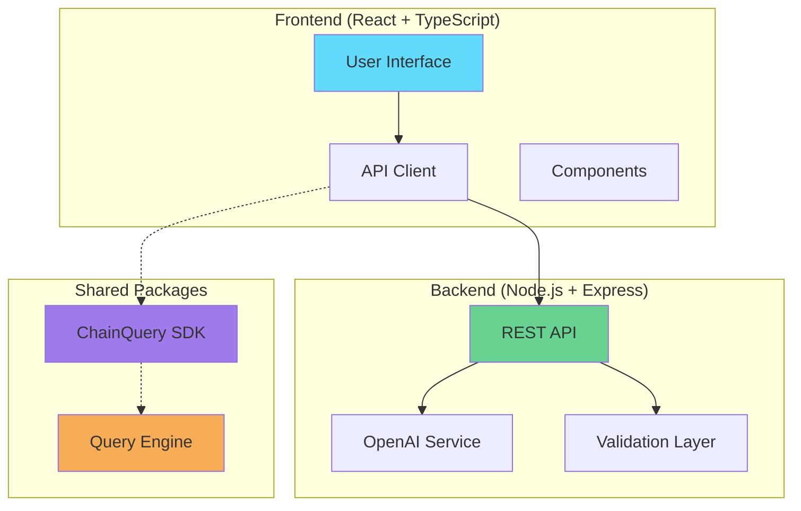

# 🔗 ChainQuery AI

[](https://choosealicense.com/licenses/mit/)
[](https://www.typescriptlang.org/)
[](https://reactjs.org/)
[](https://nodejs.org/)
[](https://openai.com/)
[](https://pnpm.io/)

> **A modern, AI-powered platform for natural language blockchain data querying and analysis**

ChainQuery AI transforms complex blockchain queries into simple, natural language interactions. Built with cutting-edge technologies including OpenAI GPT, React, and Node.js, it provides an intuitive interface for exploring blockchain data without requiring technical expertise.

## 🌟 Features

### 🤖 **AI-Powered Queries**
- Natural language processing with OpenAI GPT-3.5-turbo
- Intelligent query interpretation and response generation
- Support for complex blockchain data analysis requests

### 🎨 **Modern Frontend**
- Beautiful, responsive UI built with React 18 and TailwindCSS
- Real-time query processing with loading states
- Interactive examples and guided query suggestions
- Mobile-first responsive design

### ⚡ **High-Performance Backend**
- Express.js API with TypeScript for type safety
- Comprehensive input validation and sanitization
- CORS-enabled for secure cross-origin requests
- Detailed logging and error handling

### 🏗️ **Monorepo Architecture**
- Clean separation of concerns with workspace packages
- Shared TypeScript SDK for consistent API interactions
- Reusable query engine for blockchain data processing
- Scalable architecture for enterprise applications

## 🏗️ Architecture



## 📁 Project Structure

```
chainquery-ai/
├── apps/
│   ├── frontend/          # React + Vite frontend application
│   └── backend/           # Node.js + Express backend API
├── packages/
│   ├── query-engine/      # Core query engine package
│   └── sdk/              # ChainQuery AI SDK
└── package.json          # Root workspace configuration
```

## 🚀 Quick Start

### Prerequisites

- **Node.js** >= 18.0.0 ([Download](https://nodejs.org/))
- **pnpm** >= 8.0.0 ([Install Guide](https://pnpm.io/installation))
- **OpenAI API Key** (optional for testing) ([Get Key](https://platform.openai.com/))

### 📦 Installation

1. **Clone the repository**
   ```bash
   git clone https://github.com/yourusername/chainquery-ai.git
   cd chainquery-ai
   ```

2. **Install dependencies**
   ```bash
   pnpm install
   ```

3. **Set up environment** (optional)
   ```bash
   cd apps/backend
   cp .env.example .env
   # Edit .env and add your OpenAI API key
   ```

### 🏃‍♂️ Development

**Start all services:**
```bash
pnpm start
```

**Or start individually:**
```bash
# Backend API (port 3001)
pnpm backend:dev

# Frontend UI (port 3000)
pnpm frontend:dev
```

**Access the application:**
- 🌐 **Frontend**: http://localhost:3000
- 🔌 **Backend API**: http://localhost:3001
- 📖 **API Docs**: http://localhost:3001/api/query

### 🏗️ Building for Production

```bash
# Build all packages and applications
pnpm build

# Start production servers
pnpm start:prod
```

## 🧪 Testing

Run the comprehensive test suite:
```bash
# Run all tests
pnpm test

# Run tests with coverage
pnpm test:coverage

# Run specific test suites
pnpm test:frontend
pnpm test:backend
pnpm test:packages
```

## Applications

### Frontend (`apps/frontend`)
- React 18 with TypeScript
- Vite for fast development and building
- Modern UI for blockchain data visualization

### Backend (`apps/backend`)
- Node.js with Express and TypeScript
- RESTful API for blockchain data queries
- Integration with query-engine and SDK packages

## Packages

### Query Engine (`packages/query-engine`)
Core query processing engine for blockchain data analysis.

### SDK (`packages/sdk`)
Client SDK for interacting with ChainQuery AI services.

## Scripts

- `pnpm dev` - Start all applications in development mode
- `pnpm build` - Build all packages and applications
- `pnpm lint` - Run linting across all packages
- `pnpm test` - Run tests across all packages
- `pnpm clean` - Clean build artifacts

## 💻 Technologies

### Frontend Stack
- **React 18** - Modern React with hooks and concurrent features
- **TypeScript** - Type-safe development with excellent IDE support
- **Vite** - Lightning-fast build tool and dev server
- **TailwindCSS** - Utility-first CSS framework for rapid UI development
- **ESLint** - Code linting and formatting

### Backend Stack
- **Node.js** - JavaScript runtime for server-side development
- **Express.js** - Fast, unopinionated web framework
- **OpenAI API** - GPT-3.5-turbo for natural language processing
- **TypeScript** - Type safety for backend development
- **CORS** - Cross-origin resource sharing middleware

### Development Tools
- **pnpm Workspaces** - Efficient monorepo package management
- **Concurrently** - Run multiple development servers
- **tsx** - TypeScript execution for Node.js
- **Jest** - Testing framework with coverage reports
- **GitHub Actions** - Continuous integration and deployment

## 📊 API Documentation

### Base URLs
- **Development**: `http://localhost:3001`
- **Production**: `https://your-domain.com`

### Endpoints

#### `POST /api/query`
Process natural language blockchain queries.

**Request:**
```json
{
  "query": "Show me the latest 10 blocks with transaction counts"
}
```

**Response:**
```json
{
  "result": "Here are the latest 10 blocks with their transaction counts...",
  "executionTime": 1250,
  "timestamp": "2025-09-23T10:30:00Z"
}
```

#### `GET /health`
Check service health and status.

**Response:**
```json
{
  "status": "healthy",
  "uptime": 3600,
  "timestamp": "2025-09-23T10:30:00Z",
  "environment": "development"
}
```

## 🔧 Configuration

### Environment Variables

Create `apps/backend/.env`:
```env
NODE_ENV=development
PORT=3001
OPENAI_API_KEY=your_openai_api_key_here
```

### Development Scripts

| Script | Description |
|--------|-------------|
| `pnpm install` | Install all dependencies |
| `pnpm build` | Build all packages and applications |
| `pnpm start` | Start both frontend and backend |
| `pnpm test` | Run all tests |
| `pnpm lint` | Lint all code |
| `pnpm clean` | Clean build artifacts |

## 🚨 Test Mode

ChainQuery AI includes a **test mode** for development without an OpenAI API key:

- ✅ All API endpoints function normally
- ✅ Returns simulated AI responses
- ✅ Perfect for development and testing
- ✅ No external dependencies required

## 🤝 Contributing

We welcome contributions! Please see our [Contributing Guide](CONTRIBUTING.md) for details.

1. Fork the repository
2. Create a feature branch (`git checkout -b feature/amazing-feature`)
3. Commit your changes (`git commit -m 'Add amazing feature'`)
4. Push to the branch (`git push origin feature/amazing-feature`)
5. Open a Pull Request

## 🔒 Security

If you discover a security vulnerability, please see our [Security Policy](SECURITY.md).

## 📄 License

This project is licensed under the MIT License - see the [LICENSE.md](LICENSE.md) file for details.

## 🙏 Acknowledgments

- [OpenAI](https://openai.com/) for providing the GPT API
- [React](https://reactjs.org/) team for the amazing framework
- [Vite](https://vitejs.dev/) for the blazing fast build tool
- [TailwindCSS](https://tailwindcss.com/) for the beautiful styling

## 📞 Support

- 📧 **Email**: support@chainquery-ai.com
- 💬 **Issues**: [GitHub Issues](https://github.com/yourusername/chainquery-ai/issues)
- 📖 **Documentation**: [Wiki](https://github.com/yourusername/chainquery-ai/wiki)

---

<div align="center">
  <p>Made with ❤️ by <a href="https://github.com/yourusername">Your Name</a></p>
  <p>
    <a href="#top">⬆️ Back to Top</a>
  </p>
</div>
